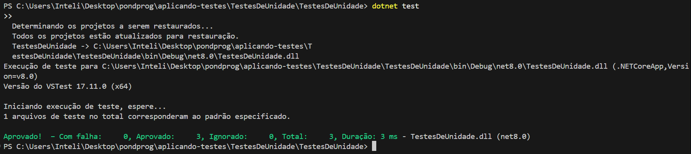
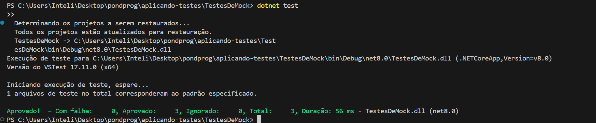
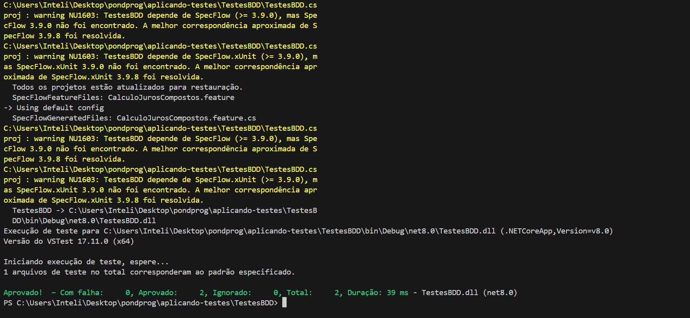

## Testes de Unidade
### Descrição
Os testes de unidade verificam a funcionalidade de métodos individuais de forma isolada.

### Exemplo
Testamos a conversão de Fahrenheit para Celsius. Dois cenários:
1. `32°F` deve resultar em `0°C`.
2. `212°F` deve resultar em `100°C`.

---

## Testes de Mock
### Descrição
Mocks permitem simular comportamentos de dependências externas, como serviços.

### Exemplo
1. Simulação de consulta válida, retornando `true`.
2. Simulação de erro, retornando `false`.

---

## Testes BDD
### Descrição
Utilizando SpecFlow, os testes em BDD verificam cenários baseados em comportamentos descritos.

### Exemplo
1. Empréstimo de R$ 1.000,00 com juros de 2% ao mês por 12 meses resulta em R$ 1.268,24.
2. Empréstimo de R$ 500,00 com juros de 1% ao mês por 6 meses resulta em R$ 530,60.

